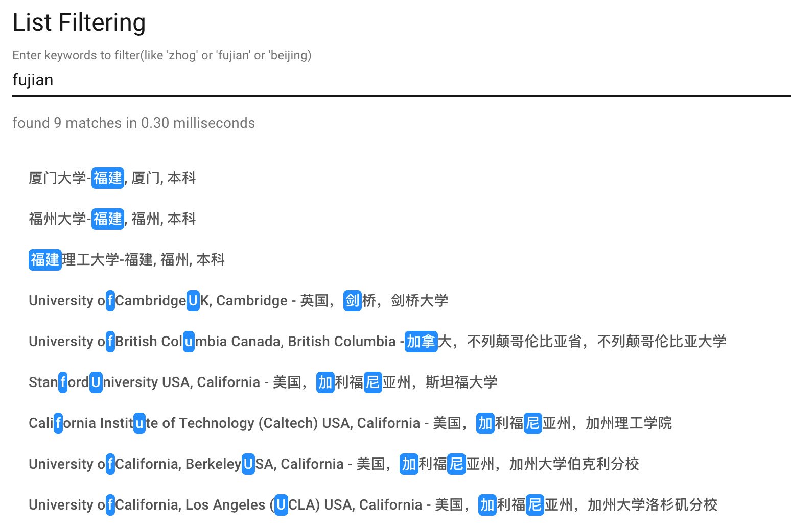

<div align="center">
    <h2>text-search-engine</h2>
    <p>A text search engine that supports mixed Chinese and English fuzzy search</p>
</div>

# Overview
[中文 README](./docs/README_zh.md)

A dynamic programming-based text search engine that supports mixed Chinese and English fuzzy search, returning the highest-weight matching results.
## Who use it?
* [Blazwitcher: A Chrome Extension For Searching and Switcher in Blazing Speed](https://chromewebstore.google.com/detail/blazwitcher-search-and-sw/fjgablnemienkegdnbihhemebmmonihg)

# Online Demo
Check out this [online demo](https://cjinhuo.github.io/text-search-engine/) if you are interested.



# Installation
```bash
npm i text-search-engine
```
## Supported Environments
Supports both `Node.js` and `Web` environments.

# Usage
## search
### Pure English Search
```javascript
import { search } from 'text-search-engine'

const source = 'nonode'

search(source, 'no') //[[0, 1]]
// Matches 'no', continuous characters have higher weight
search(source, 'nod') // [[2, 4]]
search(source, 'oo') // [[1, 1],[3, 3]]
```

### Pure Chinese Search
```javascript
import { search } from 'text-search-engine'

const source = '地表最强前端监控平台'

search(source, 'jk') // [[6, 7]]
search(source, 'qianduapt') // [[4, 5],[8, 9]]
```
`search('地表最强前端监控平台', 'qianduapt')` Match result: 地表最强<mark>前端</mark>监控<mark>平台</mark>

### Mixed Chinese and English Search
```javascript
import { search } from 'text-search-engine'

search('Node.js 最强监控平台 V9', 'nodejk') //[[0, 3],[10, 11]]

const source_2 = 'a_nd你你的就是我的'
search(source_2, 'nd') //[[2, 3]]
// Matches '你你的'
search(source_2, 'nnd') //[[4, 6]]
// Matches 'a_'n'd你你的就'是我的'
search(source_2, 'nshwode') //[[2, 2],[8, 10]]
```
`search('Node.js 最强监控平台 V9', 'nodejk')` Match result: <mark>Node</mark>.js 最强<mark>监控</mark>平台 V9

### Space-separated Search
Adding spaces makes each term independent. Each term starts matching from the beginning, and matched terms will be removed, so the next term starts matching from the beginning and ignores previously matched terms.

```javascript
const source_1 = 'Node.js 最强监控平台 V9'

search(source_1, 'jknode') // undefined
search(source_1, 'jk node') // [[10, 11],[0, 3]]
```
`search('Node.js 最强监控平台 V9', 'jk node')` Match result: <mark>Node</mark>.js 最强<mark>监控</mark>平台 V9

## highlightMatches
This API is used for quickly validating text match highlights. It returns ANSI escape codes that can be output using console.log in both Web and Node.js environments to see the highlighted text.
```javascript
import { highlightMatches } from 'text-search-engine'
console.log(highlightMatches('Node.js 最强监控平台 V9', 'nodev9'))
```
The console will output: <mark>Node</mark>.js 最强监控平台 <mark>V9</mark>

# Performance
|       | Time Complexity          | Space Complexity         |
| ----- | ------------------------ | ------------------------ |
| Best  | O(M(source))             | O(M(source))             |
| Worst | O(M(source) * N(target)) | O(M(source) * N(target)) |


# 📞 contact
welcome to raise issue, you can contact me on wx or email if you have some good suggestion(notes: text-search-engine)
* wx：cjinhuo
* email: cjinhuo@qq.com